<h1 style="color:#444444;font-size:40px;">作业 5</h1>
---

1)Give the three representations of an AND gate and say in your words what AND means.

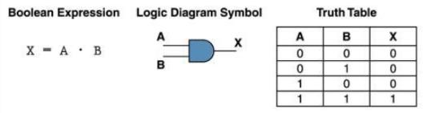

I think an AND gate is the multiplication of inputs,e.g. 0 × 0 -> 0 | 0 × 1 -> 0 | 1 × 0 -> 0 | 1 × 1 -> 1,it is quite similar to the Boolean Expression X = A × B

2)Give the three representations of an XOR gate and say in your words what XOR means.

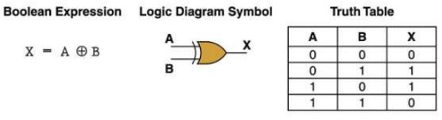

I think a XOR gate is similar to the binary addition,e.g. 0 + 0 - > 0 | 0 + 1 -> 1 |1 + 1 -> 10(overflow) -> 0

3)Draw a circuit diagram corresponding to the following Boolean expression:(A+B)(B+C)

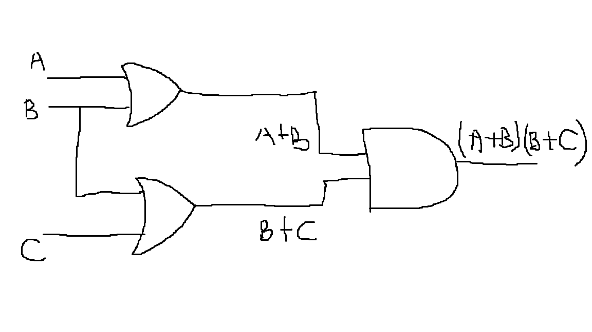

4)Show the behavior of the following circuit with a truth table.

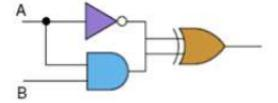

|A|B|A＇|A • B|A＇ ⊕ (A • B)|
|:-----:|:-----:|:-----:|:-----:|:-----:|
|0|0|1|0|1|
|0|1|1|0|1|
|1|0|0|0|0|
|1|1|0|1|1|

5)What is circuit equivalence?Use truth table to prove the following formula.

(AB)＇= A＇+ B＇

|A|B|(AB)＇|A＇+ B＇|
|:-----:|:-----:|:-----:|:-----:|
|0|0|1|1|
|0|1|1|1|
|1|0|1|1|
|1|1|0|0|

6)There are eight 1bit full adder integrated circuits.Combine them to 8bit adder circuit using the following box diagram.

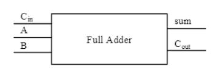
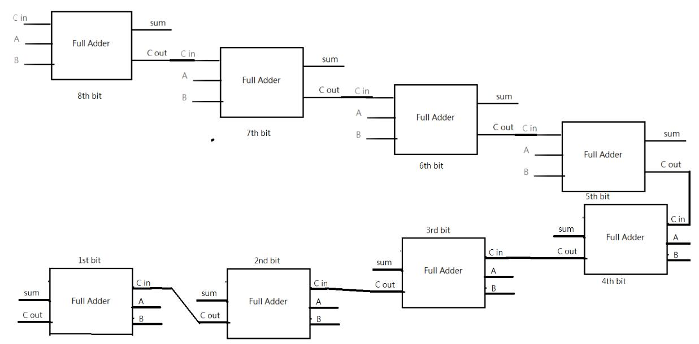

7)Logical binary operations can be used to modify bit pattern.Such as 

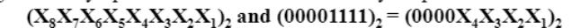
We called that (00001111)2 is a mask which only makes low 4 bits to work.

(1)
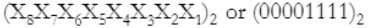 = 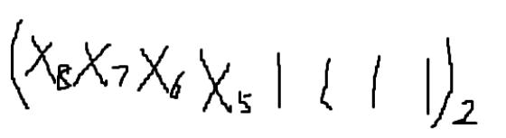

(2)
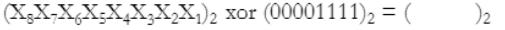 = 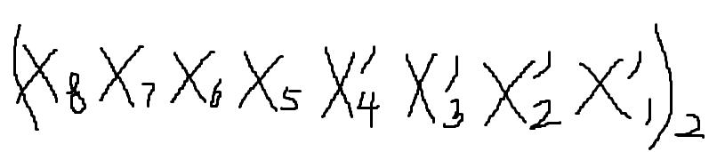

(3)
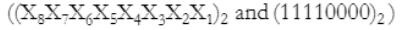 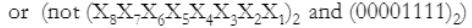 = 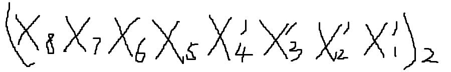

1)Logic gate

Logic gate is an idealized or physical device implementing a Boolean function; that is, it performs a logical operation on one or more binary inputs and produces a single binary output. 

2)Boolean algebra

Boolean algebra is the branch of algebra in which the values of the variables are the truth values true and false, usually denoted 1 and 0 respectively.

1)Flip-flop 中文是?

Flip-flop 中文是触发器

2)How many bits information does a SR latch store?

A SR latch store 1bit information.

