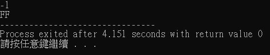
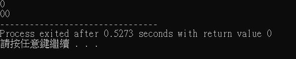
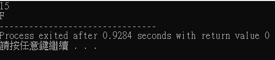
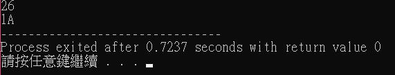
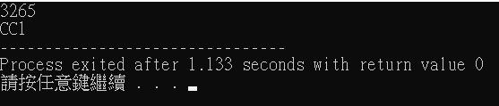
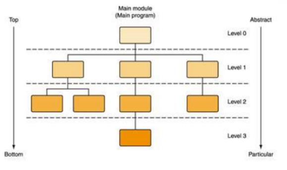
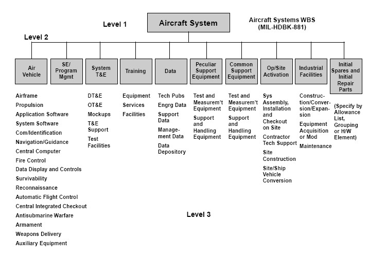

<h2 style="color:black;text-shadow:1px 1px 5px black;text-align:center;font-size:30px">作业-8</h2>

<h3 style="color:black;font-size:25px">1.阅读Pseudocode Standard</h3>

用伪代码描述将十进制转换成十六进制的方法

<pre style="color:black;border-raidus:15px;border:2px solid #666666;padding:15px;height:auto;width:80%;box-shadow:0 1px 2px 1px rgba(255,255,255,0.3);">
SET decimals to inputdecimals
IF decimals <0
	SET decimals to complementation of decimals 
END IF
WHILE decimals > 15
	SET hexadecimal to decimals devide 16
	IF hexadecimal > 9 THEN
		CASE hexadecimal OF 
		10:hexadecimal = A
		11:hexadecimal = B
		12:hexadecimal = C
		13:hexadecimal = D
		14:hexadeciaml = E
		15:hexadecimal = F
		OUTPUT hexadecimal
	ELSE 
		OUTPUT hexadecimal

	SET decimals to decimals MOD 16
UNTIL decimals <15
	CASE decimals OF 
	10:decimals = A
	11:decimals = B
	12:decimals = C
	13:decimals = D
	14:decimals = E
	15:decimals = F
	OUTPUT decimals
</pre>

用C语言实现

<pre style="color:black;border-raidus:15px;border:2px solid #666666;padding:15px;height:auto;;box-shadow:0 1px 2px 1px rgba(255,255,255,0.3);">
#include <stdio.h>
int main(){
	int hexadecimal,g=0,decimals[100],mid=0,i=1,z=0;
	scanf("%d",&decimals[0]); //set decimals to inputdecimals
	if(decimals[0]<0){ //IF decimals <0
		decimals[0] = 256 + decimals[0]; //SET decimals to complementation of decimals 
	}
	while(mid!=1){
		if(decimals[g]/256==0){
			if (g>0){
				decimals[g+1] = decimals[g-1]%256;
			}
			else{
				decimals[g+1]= decimals[g]%256;
			}
			mid = 1;
		}
		else{
			decimals[g+1] = decimals[g]/255;
		}
		g++;
	}
	while(g--){
		z = 0;
	while (decimals[i]>15) //while decimals >15 
	{
		hexadecimal = decimals[i] /16; //set hexadecimal to decimals devide 16
		switch(hexadecimal){ //CASE hexadecimal OF 
			case 10:hexadecimal=65;break; //10:hexadecimal = A 
			case 11:hexadecimal=66;break; //11:hexadecimal = B
			case 12:hexadecimal=67;break; //12:hexadecimal = C 
			case 13:hexadecimal=68;break; //13:hexadecimal = D 
			case 14:hexadecimal=69;break; //14:hexadeciaml = E 
			case 15:hexadecimal=70;break; //15:hexadecimal = F 
		}
		if(hexadecimal>=65 && hexadecimal <=70){
			printf("%c",hexadecimal); //OUTPUT hexadecimal
		}
		else{
			printf("%d",hexadecimal); //OUTPUT hexadecimal
		}
		decimals[i] = decimals[i] %16; //SET decimals to decimals MOD 16
		z=1;
	}
	//UNTIL decimals <15
	switch(decimals[i]){ //CASE decimals OF 
			case 10:decimals[i]=65;break; //10:decimals = A 
			case 11:decimals[i]=66;break; //11:decimals = B
			case 12:decimals[i]=67;break; //12:decimals = C 
			case 13:decimals[i]=68;break; //13:decimals = D 
			case 14:decimals[i]=69;break; //14:decimals = E 
			case 15:decimals[i]=70;break; //15:decimals = F
		}
	if(decimals[i]>=65 && decimals[i] <=70){
			printf("%c",decimals[i]); //OUTPUT decimals
		}
	else if (decimals[i]==0){
		printf("00");
	}
	else{    
			if(z==1){
			printf("%d",decimals[i]); //OUTPUT decimals
		}
			else{
				printf("0%d",decimals[i]);
			}
		}
		i++;
	}
}
</pre>

算法真的不好 还有bug 抱歉==

使用-1，0，1，15，26，3265作为输入测试程序

<h3 style="color:black;font-size:25px">2.名词解释与对比</h3>
<h4 style="color:black;font-size:20px">Top-down design</h4>
<h5 style="color:black;font-size:20px">A top-down approach (also known as stepwise design and in some cases used as a synonym of decomposition) is essentially the breaking down of a system to gain insight into its compositional sub-systems in a reverse engineering fashion.</h5>
<h5 style="color:black;font-size:20px">Top-down design(被认为是一个步骤式设计，在一些情况会被用作为分治的同义词)是一种在反向工程中基于系统分解去得到某事物里构成那个事物的子系统的设计。</h5>
<h4 style="color:black;font-size:20px">Work breakdown structure(WBS)</h4>
<h5  style="color:black;font-size:20px">A work-breakdown structure in project management and systems engineering, is a deliverable-oriented breakdown of a project into smaller components. </h5>
<h5 style="color:black;font-size:20px">在项目管理和系统工程中，Work-breakdown 结构是一个面向可交付结果去分解一个项目到更小的项目的方法。</h5>
<h4 style="color:black;font-size:20px">WBS 与 Top-down设计的异同</h4>
<h5 style="color:black;font-size:20px">Top-down design 与WBS 都是以分解事物为目的，但是Top-down design分解的目的是为了让事情能更容易的处理，而去将一个大事件分解成更容易，在从更容易的事在分解成更更容易，同等级的事可能会有关联，图形为类似于纵式分解，而WBS分解的目的更多的是为了将一个项分拆开成几个部分去分配给不同部门去做单独的事，各分解的事都不会于其他同等级的事有关联，图形为类似于横式分解</h5>
<h5 style="text-align:center;color:black;font-size:20px;">纵向

横向

<h3 style="color:black;font-size:25px">3.洗衣机</h3>
<pre style="color:black;border-raidus:15px;border:2px solid #666666;padding:15px;height:auto;width:80%;box-shadow:0 1px 2px 1px rgba(255,255,255,0.3);">以我的观察发现我宿舍的洗衣机洗衣有以下的步骤
1.浸洗
2.洗涤
3.漂洗
4.放水 
</pre>

<h4 style="color:black;font-size:20px">洗衣过程：首先执行漫洗的操作，大致是注水和浸一段时间的水</h4>
<pre style="color:black;border-raidus:15px;border:2px solid #666666;padding:15px;height:auto;width:80%;box-shadow:0 1px 2px 1px rgba(255,255,255,0.3);">注水操作

water_in_switch(open)
	IF INPUT_switch is open
		open the water_in_switch
		IF get_water_volume() do not equal INPUT_water_volume THEN
			CONTINUE
		ELSE 
			water_in_switch(close)
	ELSE
		END 
</pre>
<pre style="color:black;border-raidus:15px;border:2px solid #666666;padding:15px;height:auto;width:80%;box-shadow:0 1px 2px 1px rgba(255,255,255,0.3);">浸水操作

Hold_Water()
	SET Start_Time to time_counter()
	SET Wait_Time to 600
	SET END_Time to Start_Time ADD Wait_Time
	WHILE time_counter() do not equal END_Time
		CONTINUE
	ENDWHILE
	END
</pre>
<h4 style="color:black;font-size:20px">然后是洗涤的过程</h4>
<pre style="color:black;border-raidus:15px;border:2px solid #666666;padding:15px;height:auto;width:80%;box-shadow:0 1px 2px 1px rgba(255,255,255,0.3);">洗涤和漂洗操作（因为两者都是一样的操作，可节录成一个操作形式）

WASH()
	SET wash_count TO 50
	SET current_wash_count TO 0
	WHILE current_wash_count < wash_count
			motor_run(right)
			motor_run(stop)
			motor_run(left)
			motor_run(stop)
			current_wash_count = current_wash_count + 1
		IF current_wash_count > wash_count THEN
		    ENDWHILE
	END
</pre>

<h4 style="color:black;font-size:20px">最后是排水的过程</h4>
<pre style="color:black;border-raidus:15px;border:2px solid #666666;padding:15px;height:auto;width:80%;box-shadow:0 1px 2px 1px rgba(255,255,255,0.3);">water_out_switch(open)
	IF INPUT_switch is open
		open the water_out_switch
		IF get_water_volume() do not equal 0 THEN
			CONTINUE
		ELSE
			water_out_switch(close) 
	ELSE 
		END</pre>