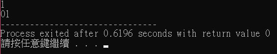

<h2 style="color:black;text-shadow:1px 1px 5px black;text-align:center;font-size:30px">作业-8</h2>

<h3 style="color:black;font-size:25px">1.阅读Pseudocode Standard</h3>

用伪代码描述将十进制转换成十六进制的方法

<pre style="color:black;border-raidus:15px;border:2px solid #666666;padding:15px;height:auto;width:80%;box-shadow:0 1px 2px 1px rgba(255,255,255,0.3);">
SET decimals to inputdecimals
IF decimals <0
	SET decimals to complementation of decimals 
END IF
WHILE decimals > 15
	SET hexadecimal to decimals devide 16
	CASE hexadecimal OF 
	10:hexadecimal = A
	11:hexadecimal = B
	12:hexadecimal = C
	13:hexadecimal = D
	14:hexadeciaml = E
	15:hexadecimal = F
	OUTPUT hexadecimal
	SET decimals to decimals MOD 16
UNTIL decimals <15
	CASE decimals OF 
	10:decimals = A
	11:decimals = B
	12:decimals = C
	13:decimals = D
	14:decimals = E
	15:decimals = F
	OUTPUT decimals
</pre>

用C语言实现

<pre style="color:black;border-raidus:15px;border:2px solid #666666;padding:15px;height:auto;;box-shadow:0 1px 2px 1px rgba(255,255,255,0.3);">
#include <stdio.h>
int main(){
	int hexadecimal,g=0,decimals[100],mid=0,i=1,z=0;
	scanf("%d",&decimals[0]); //set decimals to inputdecimals
	if(decimals[0]<0){ //IF decimals <0
		decimals[0] = 256 + decimals[0]; //SET decimals to complementation of decimals 
	}
	while(mid!=1){
		if(decimals[g]/256==0){
			if (g>0){
				decimals[g+1] = decimals[g-1]%256;
			}
			else{
				decimals[g+1]= decimals[g]%256;
			}
			mid = 1;
		}
		else{
			decimals[g+1] = decimals[g]/255;
		}
		g++;
	}
	while(g--){
		z = 0;
	while (decimals[i]>15) //while decimals >15 
	{
		hexadecimal = decimals[i] /16; //set hexadecimal to decimals devide 16
		switch(hexadecimal){ //CASE hexadecimal OF 
			case 10:hexadecimal=65;break; //10:hexadecimal = A 
			case 11:hexadecimal=66;break; //11:hexadecimal = B
			case 12:hexadecimal=67;break; //12:hexadecimal = C 
			case 13:hexadecimal=68;break; //13:hexadecimal = D 
			case 14:hexadecimal=69;break; //14:hexadeciaml = E 
			case 15:hexadecimal=70;break; //15:hexadecimal = F 
		}
		if(hexadecimal>=65 && hexadecimal <=70){
			printf("%c",hexadecimal); //OUTPUT hexadecimal
		}
		else{
			printf("%d",hexadecimal); //OUTPUT hexadecimal
		}
		decimals[i] = decimals[i] %16; //SET decimals to decimals MOD 16
		z=1;
	}
	//UNTIL decimals <15
	switch(decimals[i]){ //CASE decimals OF 
			case 10:decimals[i]=65;break; //10:decimals = A 
			case 11:decimals[i]=66;break; //11:decimals = B
			case 12:decimals[i]=67;break; //12:decimals = C 
			case 13:decimals[i]=68;break; //13:decimals = D 
			case 14:decimals[i]=69;break; //14:decimals = E 
			case 15:decimals[i]=70;break; //15:decimals = F
		}
	if(decimals[i]>=65 && decimals[i] <=70){
			printf("%c",decimals[i]); //OUTPUT decimals
		}
	else if (decimals[i]==0){
		printf("00");
	}
	else{    
			if(z==1){
			printf("%d",decimals[i]); //OUTPUT decimals
		}
			else{
				printf("0%d",decimals[i]);
			}
		}
		i++;
	}
}
</pre>

算法真的不好 抱歉==

使用-1，0，1，15，26，3265作为输入测试程序

<h3 style="color:black;font-size:25px">2.名词解释与对比</h3>
<h4 style="color:black;font-size:20px">Top-down design</h4>
<h4 style="color:black;font-size:20px">Work breakdown structure(WBS)</h4>
<h4 style="color:black;font-size:20px">管理学WBS 与 信息学Top-down设计的异同</h4>
