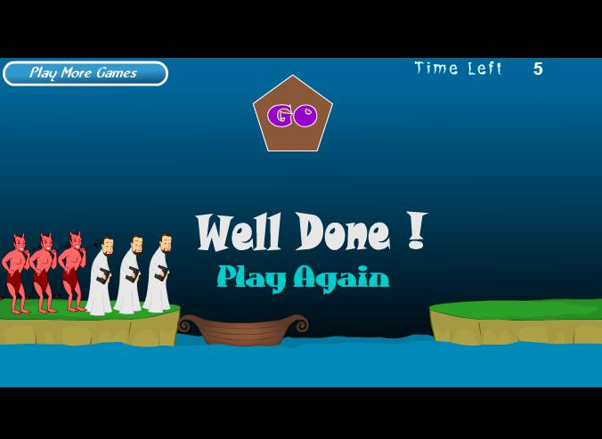

<h2 style="color:black;text-shadow:1px 1px 5px black;text-align:center;font-size:30px">作业-9</h2>

<h3 style="text-align:center;font-size:30px;color:black;">牧师与恶魔过河</h3>

<h3 style="font-size:20px;"> 游戏所包含的类和对象</h3>

<table style="text-align:center;">

<tr>
<th>类</th>
<th colspan="4">对象</th>
</tr>
<tr>
<td>人物</td>
<td>牧师（三个）</td>
<td>恶魔（三个）</td>
<td></td>
<td></td>
</tr>
<tr>
<td>按钮</td>
<td>游戏介绍按钮（一个）</td>
<td>控制船的按钮（一个）</td>
<td>重玩的按钮（一个）</td>
<td>开始的按钮（一个）</td>
</tr>
<tr>
<td>文本</td>
<td>标题（一个）</td>
<td>剩余时间的提示（一个）</td>
<td>输和赢的文字（共两个）</td>
<td></td>
</tr>
<tr>
<td>计数的东西</td>
<td>船（一个）</td>
<td>计时器（一个）</td>
<td>草地（两个）</td>
<td></td>
</tr>

</table>

<h3 style="font-size:20px;"> 类和对象的分别</h3>

类是一个抽取事物共有功能的一个东西，例如上面计数的类含盖了计算次数的功能，然后有不同的对象继承了这个计数的功能，船（不能超过两个人物），计时器（为零时就完结游戏），草地（计算牧师与恶魔的数量关系）

对象就是一个类实例出来的东西，他必需要有该类的功能，并且新增了自己独有的功能

<h3 style="font-size:20px;"> 恶魔的属性和方法</h3>

<h4 style="font-size:20px;"> 恶魔的属性</h4>

<ul>

<li>图片
<li>占了一个人的单位
<li>可以被点击

</ul> 

<h4 style="font-size:20px;"> 恶魔的方法</h4>

<ul>

<li>可以杀牧师

</ul>

<h3 style="font-size:20px;"> 恶魔被点击与其他对象沟通的过程</h3>

当恶魔被点击的时候，它会确认现在的位置（是在船或者在草地上），这就要跟船或草地沟通，然候沟通后执行相应的操作，在船的时候就上岸，在草地的时候就上船。

<h3 style="font-size:20px;">类或对象会是动词吗</h3>

类不是，对象是，因为类只是一个属性合方法的集合，不能执行，而对象可以执行它所拥有的方法。
