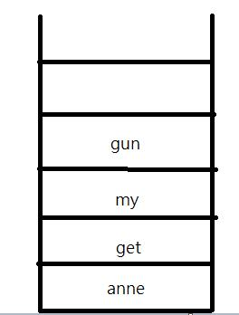

<h2 id="anime" style="text-align:center;font-size:30px">作业-10</h2>

<h3>Bubble Sort the list:33,56,17,8,95,22.Make sure the final result is from small to large.</h3>
<h3>White out the list after the 2nd pass.</h3>

the first sort

$$ 8 \ 33 \ 56 \ 17 \ 95 \ 22 $$

the second sort

$$ 8 \ 17 \ 33 \ 56 \ 95 \ 22 $$

the last sort

$$ 8 \ 17 \ 22 \ 33 \ 56 \ 95 $$

    <ul>
    <li><a>1st</a></li>
    <li><a>2nd</a></li>
    <li><a>3rd</a></li>
    </ul>

<h3>Give a sorted array as list={60,65,75,80,90,95}.</h3>
<h3>Design an algorithm to insert the value of x into the sorted array.Then test the algorithm with value 50,67,99.</h3>

Here is my algorithm about insertion to list

<pre>
    ##BINARY INSERT
list = {60,65,75,80,90,95}

SET x TO input_value
IF x < list.head 
    FOR element IN EACH list.element
        element.index +1
    SET list.head TO x
    END IF
ELSE IF x > list.tail
    SET list.tail + 1 TO X
    END IF
ELSE
    SET middle TO (list.head + list.tail) DEVIDE 2
    IF X = middle.element 
        FOR element IN FROM middle.element TO list.tail.element
            element.index + 1
        SET list.middle TO x
        END IF
    ELSE 
        WHILE x <> middle.element 
        IF x > middle.element
            SET middle TO (middle + list.tail) DEVIDE 2
        ELSE IF x < middle.element
            SET middle TO (list.head + middle) DEVIDE 2
        FOR element IN FROM middle.element TO list.tail.element
            element.index +1
        SET list.middle TO x
        END IF
</pre>

输入50，所有list的元素往后移一个位再在头部插入50

输入67，因为不是在头或尾部，所以从中间开始找，对比中间元素的值75，因为67小于75，然后再找头部跟中间位置找中间位置，再进行比较，直到最后找到这个数大于等于要插入的那个位置，再把后面的元素往后移一个位，在从那个位置插入67

输入99，坦白讲输入最尾的值是最开心的，因为只需把99放到最尾的位置往后移一个位置就行

<h3>为啥测试的值是在list的头、中间和尾部？？</h3>

可能是因为要知道插入哪个值的时候这个算法是最快的，然候方便我们去应用到适用的场合上

<h3>What is the state of the stack after the following sequence of Push and Pop operations?</h3>
<h3>Push "anne";Push "get;Push "your";Pop; Push "my";Push "gun";<h3>

It may be like this

