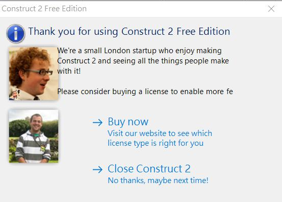
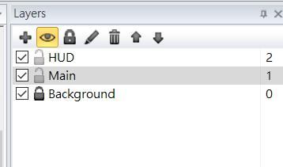
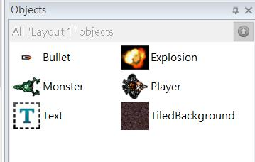
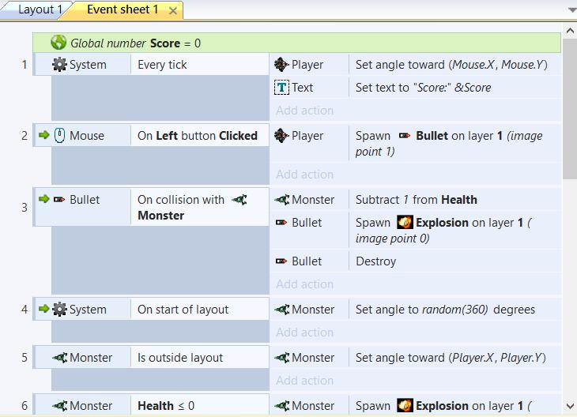

# 初用Construct 2的心得
***
### 对这个语言的初象
1. #### 用来写游戏的
2. #### 界面好像挺不错的A_A
3. #### 好像要有编程的基础。。。（那我肯定凉了）
4. #### 一直在催付费！？？

### 试用期
#### 我在官方推荐的教学里学习了这软件的使用

#### 连接：https://www.scirra.com/tutorials/37/beginners-guide-to-construct-2

#### 这个教学里面讲了有关图层的概念

#### 对象物件的概念

#### 活动事件的概念等等

#### 这个教学清晰﹑简洁，而且在很短的时间内就能实现一个完成度挺高的游戏

### ~~滑稽~~后的感想 &nbsp;&nbsp;&emsp;&emsp;&emsp;&emsp;&emsp;&emsp;&emsp;&emsp;&emsp;&emsp;&emsp;&emsp;&emsp;&emsp;&emsp;体验

#### 感觉这软件对于**0**编程基础的小白照顾的满好的，里面还有一些编程的相关概念，我觉得如果你想短时间内写一个游戏出来的话可以想想这软件A_A

### 最后付上游戏的gif

