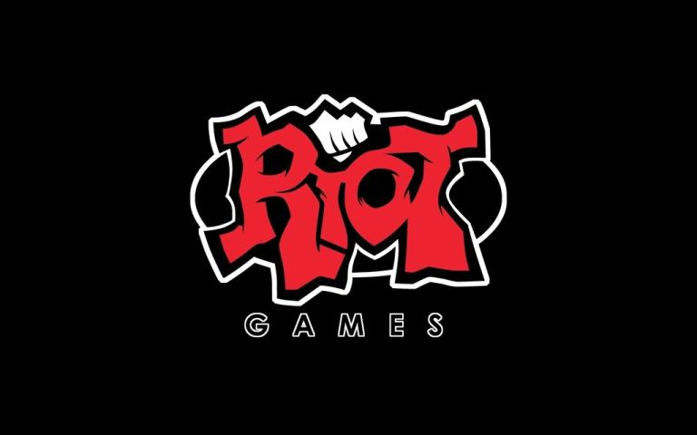
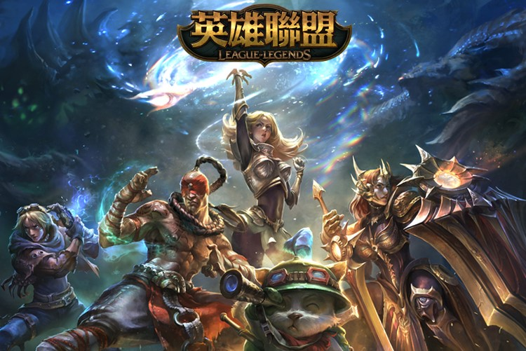

RIOT
 

GAMES

传奇的游戏公司

> 创立了与我度过青春的游戏-LOL英雄联盟

>从一个游戏工作室到被腾讯用数十亿元收购的公司

## Riot Games创始人谈最开始创业的经历
### 在最开始工作室开发游戏的时候，游戏的开发并不顺利，又面临着金钱不足的困难，当时是抱着先开发最简单的游戏框架，去跟投资商要钱，慢慢的把游戏给完善。

## LOL的优势
### 凭着当时火热的魔兽世界相似的游戏类别、比魔兽更好的优化界面与操作，对初学者非常友善，成为了热门的游戏。

## 我对LOL的看法
### LOL的设计师们是真的很有想法，因为他们把游戏里面的世界观描述的很细节，不同角色有不同的故事，而且有些角色还有关联，使得我在玩游戏的过程里不单止是玩，还能了解角色的背景，这是挺好的。

## LOL的缺点
### 我个人觉得这游戏太消耗时间了，偶尔玩玩就好，别沉迷进去。

## >>与朋友一起玩是最爽的A_A

#### 在迟交作业的最后说一声

 IG牛逼66666 

