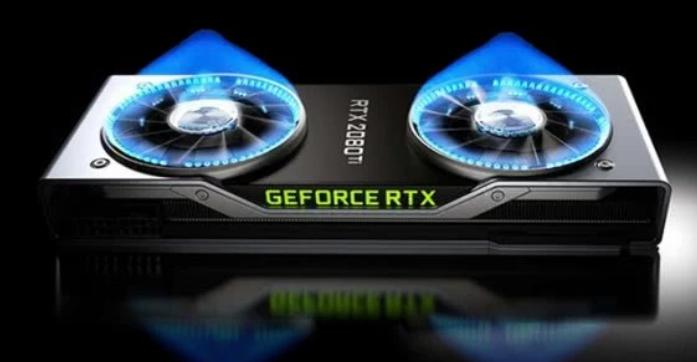
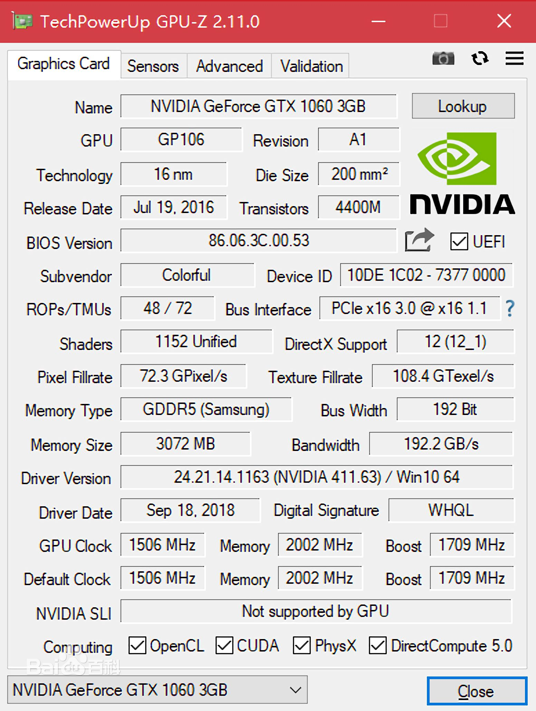

<h1 style="color:black;font-size:35px;text-align:center;">判别显卡性能（参数篇）</h1>
<h3 style="color:#888888;font-size;35px">写这篇文章的理由鉴于在这个需求大量的图像处理时代的面前，显卡是作为很多人买电脑的考虑因素，怎么选择适合自己所需要的显卡是至关重要的事。
</h3>

被称为显卡的煤气灶(= =)

<h2 style="color:#666666;font-size;30px;">首先，让我们来科普一下显卡里面比较重要的性能参数，显卡里面有四个比较重要的参数。</h2>

1)流处理器：即着色单元，将多媒体的图形数据流进行处理，负责解码和执行CPU传送过来得流数据，在同架构显卡中，流处理器数量越多，性能也越强大。

2)核心频率：即显卡的显示核心的工作频率，在相同级别的显示核心中，频率的高低确定了显卡的性能。

3)显卡内存：就像计算机的内存一样，用来暂存将要处理的数据以及取得数据，内存的大小确定了每次取数据的多少，越大的话就可以减小内存读入的次数，从而提高速度。

4)显存位宽：是显存中的数据交给显卡的通道，位宽越大，显卡传送数据也越快，那就有效的提高显卡的性能。

<h2 style="color:#666666;font-size;35px;text-align:center;">要讲一讲一款工具來看显卡的数据</h2>
<h2 style="color:#666666;font-size;35px;text-align:center;">GPU-Z</h2>

GPU-Z是一款显卡识别软件，可显示GPU核心，以及运行频率、带宽、传感器信息等。

以下是GPU-Z的介面

可以看到界面里有很多不同的数据，不同的规格等等，这些数据都是可以作为大致判断显卡性能的参考。

<h3 style="color:#666666;font-style:bold;">最后，所有参数方面的比较只能基于相同的架构下。不同架构的显卡即使从参数上看很接近，实际性能可能会大相径庭，不同架构的显卡可以看评测来比较性能。</h3>

参考资料：

[决定显卡性能的比较重要的几个参数是什么？](http://blog.csdn.net/xiaoyafang123/article/details/79462080){:target="_blank"}
