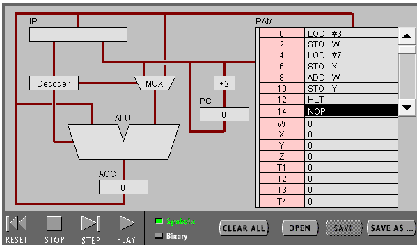
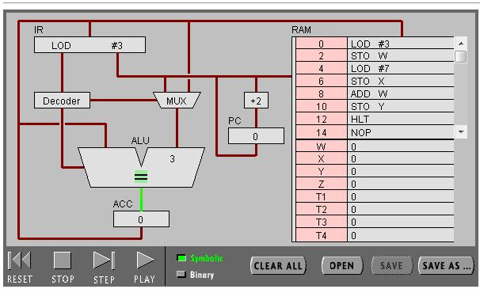
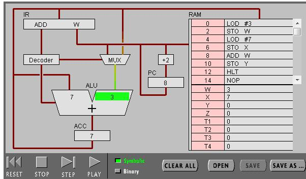
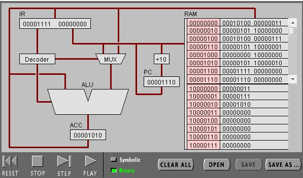
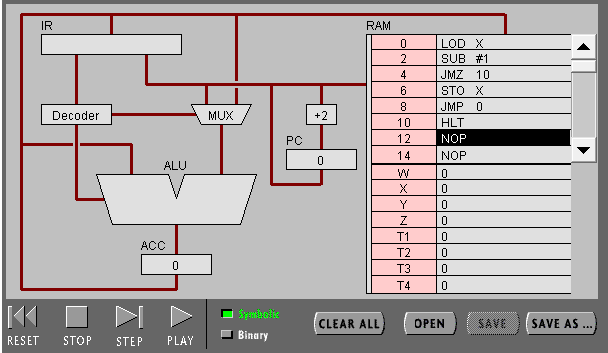
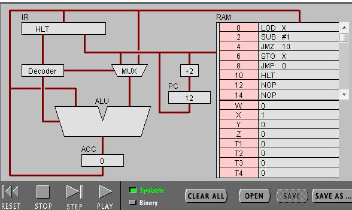
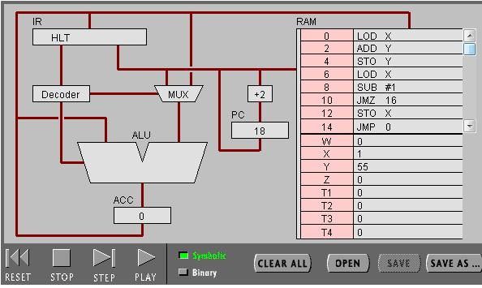

<h1 style="text-align:center;color:#0080FF;font-weight:bold;font-size:40px">PIPPIN实验报告</h1>

18340128 罗濠铭

实验目的

<ul style="color:black">
    <li>理解冯·诺伊曼计算机的结构
    <li>理解机器指令的构成
    <li>理解机器指令执行周期
    <li>用汇编编写简单程序
</ul>

<h2 style="text-align:center;">task 1</h2>

PROGRAM 1 流程

首先，输入代码

然候运行程序

运行结果

PC,IR寄存器的作用

PC寄存器用來計数下一个指令的地址

IR寄存器用來加载指令

ACC寄存器的全称与作用

ACC:Accumulator（累加器）,用来储存CPU计算时产生的中间结果,这样就可以省去计算过程要把数据写入内存所需的时间

LOD #3指令的Fetch-Execute cycle

首先，IR寄存器加载到LOD #3指令，并且传到Decoder去解码这条指令

然后,ALU根据Decoder传来的指令来判断运算操作符(此时为=)，因为指令是LOD，所以不用从ACC获得数据，接着MUX(数据选择器)根据Decoder传来的指令切换模式获取数据(immidiate mode)，最后由ALU执行运算操作

ADD W指令的Fetch-Execute cycle

IR寄存器加载ADD W指令，并且传到Decoder去解码这条指令

然后，ALU根据Decoder传来得指令来将操作符变为+，因为指令是ADD，所以要从ACC那里获得一个值，接着MUX根据Decoder传来的指令切换模式(Direct Addressing mode)到指定内存(W)获得值，最后由ALU执行运算操作符

LOD #3 与 ADD W指令在Fetch-Execute有什么不同?

LOD #3 不用从ACC那里获取值作运算，ADD W 要从ACC获取值、LOD #3 不需要从内存获取值，ADD W 要从内存获取值

Binary

LOD #7 00010100 00000111

前面00010100的前3个bit为无意义，第四个bit指要什么模式取值，0为从内存取，1为直接的值，后面4个bits为运算操作的模式0100为LOD，后面00000111为值或者内存地址。

RAM Address

在指令区RAM每个指令占了2个btyes，而数据区每个地址占1个btye

该机器CPU是8位

C代码的表示

int8_t a = 3;

int8_t b = 7;

int8_t c = a + b;

<h2 style="text-align:center;">task 2</h2>

PROGRAM 2的流程

首先，输入代码

然候运行到最后

Program 2程序的作用

将一个变量值减到1为止

对应C的程序

int8_t a = 3;

for(a;a>1;a--){}

修改程序，用机器语言实现10+9+8+...+1，并把结果放到内存Y

写出C语言的计算过程

int8_t sum = 0;

int8_t a = 10;

for(a;a>1;a--)
{ sum = sum + a;
}

写出机器语言的计算过程

LOD X

ADD Y

STO Y

LOD X

SUB #1

JMZ 16

STO X

JMP 0

HLT

总结高级语言与机器语言的区别与联系

我感觉高级语言比较有逻辑可言，易读性高，所以很容易修BUG。相反，机器语言比较有深入性，能真正知道计算机在这个程序里面的操作，但可读性低，难修BUG。

它们之间会有一个对应的表来对应两边的每条指令来将高级语言编译成机器语言

实验小结

这次的实验目标顺利的达成了，通过这次实验的完成，我学到了CPU怎么在运作，更加的巩固我对CPU的了解，谢谢。

