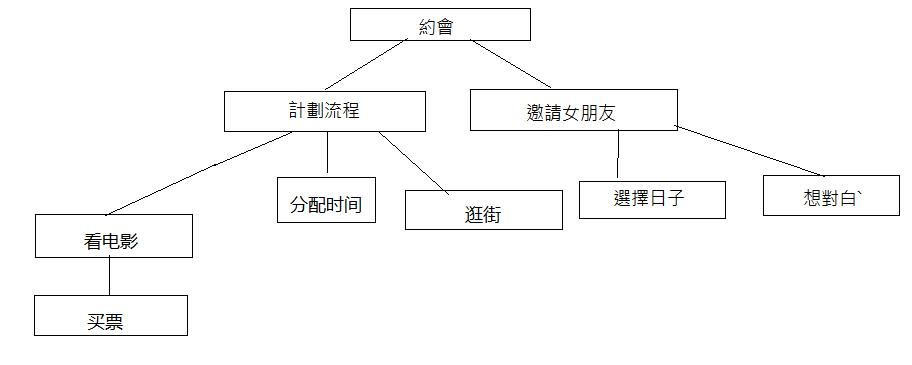

<h2 style="color:black;text-align:center;font-size:30px;">至顶向下，逐步求精</h2>

<h3>至顶向下设计方法（Top-down design)，是一种以分解问题来解决问题的方法。</h3>
<h3>

引用于在维基百科上的话
 

"In the software development process, the top-down and bottom-up approaches play a key role."

也就是说，在开发软件上，Top-down design起了一个重要的价值。那么BB了这么久，什么是Top-down design??

据我了解，Top-down design强调的是对问题的了解，把问题拆开成容易的问题来，如果没解决问题核心的话就反复的去分解问题，直到拆到能解决问题的核心的事为止。

举个例子，约会==

没女朋友的我只能贴这个=】

假设现在要想约会，那我们会怎么计划来解决问题了，首先要知道问题的核心，就是要有一个约会的事情，那么我们一开始要计划流程和邀情她，计划流程的时候，如果会看电影的话就提前买票，可能要分配好当天的时间等等，邀请她的话要在她有空的时候，可能要想好台词来邀请她

我们可以看出来问题的核心就是约会当天的事情和邀请她，然候拆成更小的问题来解决这个大的问题

当然以上的内容属于单身狗而且没恋爱经历的人的想法作为供了解Top-down design设计方法的一个虚拟的流程

最候，我们再来一个例子，就是我们日常使用的洗衣机。

洗衣机洗衣服有基本的几个步骤

<ul>
<li>注水</li>
<li>浸洗</li>
<li>洗涤</li>
<li>甩干</li>
<li>排水</li>
</ul>

但是这些只是大的步骤，是解决问题的核心。当中注水会涉及到计算水量，控制进水口，而浸洗、洗涤、甩干涉及到控制转盘，排水涉及到控制排水口，那么这些就是实际解决问题核心的事

参考资料

[Top-down Design](http://en.wikipedia.org/wiki/Top-down_and_bottom-up_design){:target="_blank"}

