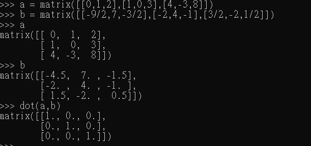

<h1>Python简单的实现科学计算</h1>

<h2>实验目的</h2>
<ul style="font-size:18px">
    <li>Python语言的了解</li>
    <li>使用Python做科学的计算</li>
</ul>

<h2>实验环境</h2>
<ul style="font-size:18px">
    <li>编程工具:Python(winpython)</li>
    <li>操作系统:Windows</li>
</ul>

<h2>使用Python求解作业的题目</h2>
<h3>高数题</h3>

因为没有高数，所以只能在数分里面找题目

求极限

$$ \lim_{n\rightarrow0}\frac{\sqrt[2]{1+x^2}-1}{1-cos(x)} $$

结果

求隐函数微分

$$ y = x + \arctan y $$

结果

求泰勒展开

$$ \frac{1}{1+\tan(x^2)} $$

结果

<h3>线性代数题</h3>

求两个矩阵的乘积

$$ A = \left[
   \begin{matrix}
   0 & 1 & 2 \\
   1 & 0 & 3 \\
   4 & -3 & 8 
   \end{matrix}
   \right]  
$$
   
$$ A^-1 = \left[
   \begin{matrix}
   -4.5 & 7 & -1.5 \\
   -2 & 4 & -1 \\
   1.5 & -2 & 0.5
   \end{matrix}
   \right]
$$

结果

求出Ax=b中x的解

$$ A = \left[
        \begin{matrix}
        1 & 3 & 4 & 0 \\
        -3 & -6 & -7 & 2 \\
        3 & 3 & 0 & -4 \\
        -5 & -3 & 2 & 9
        \end{matrix}
        \right]
$$

$$ b = \left[
       \begin{matrix}
       1 \\
       -2 \\
       -1 \\
       2
       \end{matrix}
       \right]
$$ 

结果

<h2>实验小结</h2>

确实Python是一种很好的语言，凭着其庞大的后援（库），确实值得我学习这门编程语言

