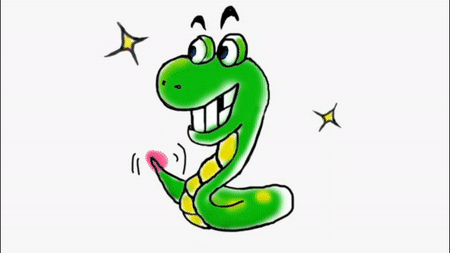

<h2 id="anime" style="text-align:center;">C语言实现贪吃蛇人机游戏总结（上）</h2>

<h3 class="h3">目标</h3>
<ul class="list">
    <li>创造一个会自己走动的蛇</li>
    <li>让蛇自动判断会不会被堵塞</li>
    <li>执行清屏操作</li>
    <li>了解linux下的非堵塞操作</li>
</ul>

<h3 class="h3">这次学习到的东西</h3>
<ul class="list">
    <li>学习到(tab)加空格的坑</li>
    <li>函数的多对象复用</li>
    <li>重温指针的用法</li>
    <li>代码数的量很多并不代表功能好（因为写了很多俗称废话的代码</li>
    <li>以后打码的时候要等逻辑更全面的时候才去写代码（对于处于低端的我就很难实现这个了，根本没逻辑A_A）</li>
</ul>
<h3 class="h3">游戏大概的设计方针</h3>
<h3 class="h3content">首先我们可以从地图实现开始 我们可以用一个二维的数组来存地图的位置信息</h3>
<h3 class="h3content">然后我们可以从蛇开始构建 首先我们要有队列的东西来表示蛇的位置，接着实现蛇的功能，例如走动、吃食物、吃了食物之后增长自己的长度以及蛇走到哪里就输等等。</h3>
<h3 class="h3content">接着我们考虑一下食物的放置以及被吃掉后重新分配位置的功能</h3>
<h3 class="h3content">最后我们来实现打印整个游戏的功能</h3>
<h3 class="h3">样例展示</h3>

<h3 class="h3">智能蛇的算法</h3>
<h3 class="h3content">为了不让智能蛇走进堵塞的路 要使用DFS（深度优先算法）+BFS（广度优先算法）</h3>
<h3 class="h3content">具体思路：遍历的问题，从蛇现在的可活动方向去判断走了那些可活动方向之后会不会卡了 参考链结：</h3>

<h3 class="h3content">就算我知道了思路了，就是不会写成代码的形式，导致用了差不多十个小时去写那个递归的代码（再去对比我那些优秀的室友，真的要跪地v_v）</h3>
<h3 style="float:left;margin-top:50px">大佬--></h3>

<h3 style="margin-top:180px;"><--我</h3>

<h3 class="h3" style="clear:both;">实际演示</h3>

<h3 class="h3content">这里我把预测路数设为2，可见智能蛇跑到被堵塞的路之前因为没路走了就停了下来</h3>

<h3 class="h3">学习总结</h3>
<h3 class="h3content">通过这次写贪吃蛇游戏，我知道了实现算法在计算机领域的重要性，因为知道了理论而实践不出来是多么的难受，可能是我掌握理论不够踏实所影响。 另外，我也从中学会了一开始写游戏的时候要把问题所相关的情况都考虑进去，因为我在写代码的中途所出现的新情况跟我现在有的代码相冲突。 由于我写这个游戏的时候只参照了学校的提示来写，纯自己想的方法实现跟别人差太远了，所以这里就不分享代码了，比我的代码优秀又没有bug的代码在网上可以随便都找到。</h3>
