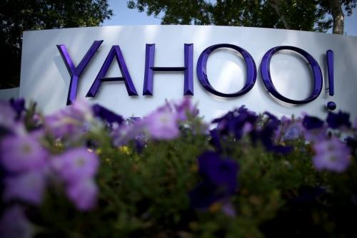

<h2 id="anime">信息化时代--互联网与流量的联系</h2>

<h3 class="h3">互联网，在二十世纪末的流行横空扫荡了人类旧有的通讯、娱乐等 据于那时候科技还没有那么发达，导致互联网需要庞大的资金来支持物理上的传输，也就是说最初的互联网并不是普通的老百姓能随便用的。</h3>

<h3 class="h3">在那个时候，出现了一个打着免费的主义来推广网络的组织，强行将网络本来要像电话一样的收费方式的格局打破，才有我们今天的互联网发展，那就是雅虎。 雅虎的出现就像神仙下凡一样，将互联网平民化。</h3>

<h3 class="h3">但是现实终归于现实，要怎么从免费的方式来解决资金的问题？ 那就需要配合到商业的知识了</h3>

<h3 class="h3">当时雅虎的主要盈利就是靠着打广告来维生，你打广告可以，但是你也要有一定的访问量人家才会愿意给钱你去挂广告，结果就出现了一个名词<流量>，这个词代表了网站浏览人数的多寡，意思是说只要流量多起来的话，那就很容易在互联网上分一杯羹，再加上有雅虎这个铁一般的从广告盈利的企业，于是导致很多仿虎的做法出现。</h3> 

<h3 class="h3">追求广告方式来赚钱的盈利方式也导致了流量风潮的出现，许多网站用类似骗流量的方式去营运自己的网站，推出什么注册就有购物卷等等的方法来吸引互联网用户的浏览。这样导致出现了很多垃圾网站，对互联网的健康产生了影响。</h3>

<h3 class="h3">另外，盲目的去追求打广告是不行的，广告的内容多多少少影响用户浏览的心态，例如在一个学习的网站上放着一个具有色情成分的广告，我不知道其他人会怎样，至少我是没心情去看网站上的内容而关掉网页，所以现在的网站营运都偏向于配合用户以前的搜索习惯等等来挑选广告，这个策络是挺好的。</h3>

<h3 class="h3">看看，突然出现一个没有关系的图多多少少会觉得不太好，同样，广告也是这样</h3>

<h3 class="h3">所以说到了现在，网站的营运不单单的只会打广告就行，也是要实际配合到环境，还要有一些吸引用户注意的素材在</h3>

<h3 class="h3">但是，只依赖于广告的盈利方式很难维持下去，因为过多的广告会导致用户有反感的情绪出现，为了让网站有盈利就要收纳很多广告，并且要有一定的流量支撑，但过多的广告也会是用户的心态造成破坏，于是，互联网出现了新的盈利方式，也让互联网流量时代慢慢的变成了用户时代，变成了吸引用户消费的形式，而不是单靠流量多来营运，而是以用户的消费来支撑网站的开销，例如常见的VIP会员等等形式，这些也是要建立在一定流量基底才会有这些形式营运。 可见互联网即使营运手段与策络不同了，但始终离不开流量的关系。</h3>

